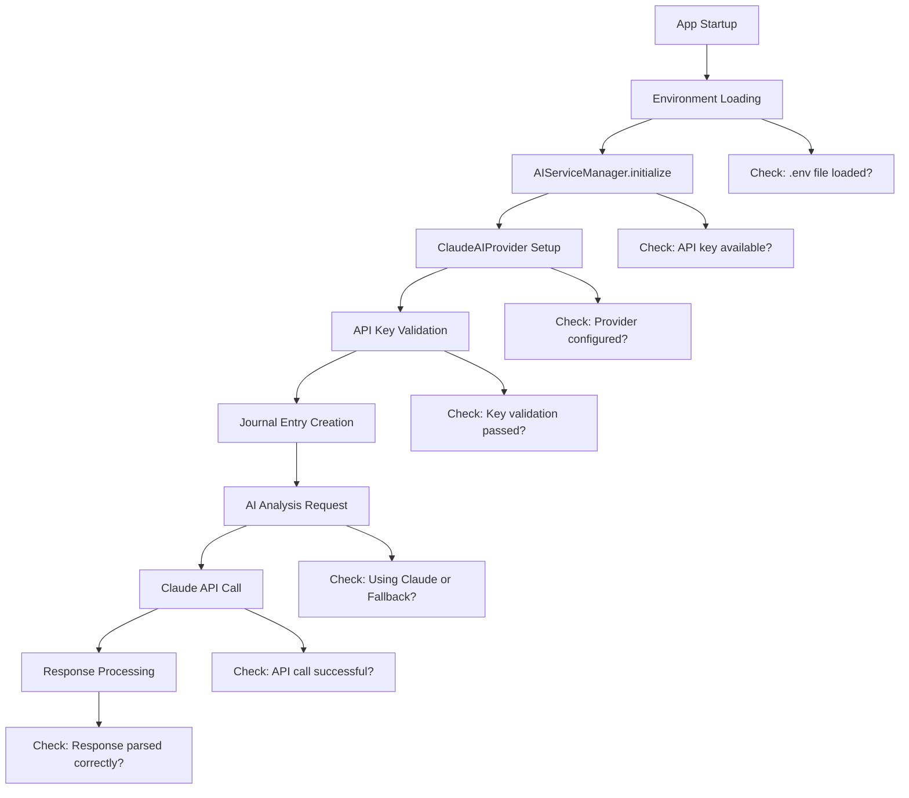

# Claude AI Integration Debugging Design

## Overview

This design addresses the disconnect between the working Claude API (confirmed by diagnostics) and the Flutter app's inability to use Claude AI in production. The issue is likely in service initialization, environment variable loading, or the integration flow between Flutter services.

## Architecture

### Problem Analysis

Based on the diagnostic results and codebase analysis, the most likely issues are:

1. **Environment Variable Loading**: Flutter may not be loading the .env file properly in production builds
2. **Service Initialization Order**: AIServiceManager may be initializing before environment variables are loaded
3. **Provider Selection Logic**: The app may be incorrectly falling back to FallbackProvider
4. **Error Handling**: Errors may be silently caught and not properly reported

### Root Cause Investigation Strategy



## Components and Interfaces

### 1. Production Environment Loader

**Purpose**: Ensure environment variables are properly loaded in production builds

```dart
class ProductionEnvironmentLoader {
  static bool _isLoaded = false;
  static Map<String, String> _envVars = {};
  
  static Future<void> ensureLoaded() async {
    if (_isLoaded) return;
    
    try {
      // Load .env file with explicit error handling
      final envFile = File('.env');
      if (await envFile.exists()) {
        final content = await envFile.readAsString();
        _parseEnvContent(content);
      }
      _isLoaded = true;
    } catch (e) {
      debugPrint('❌ Environment loading failed: $e');
      rethrow;
    }
  }
  
  static String? getClaudeApiKey() {
    return _envVars['CLAUDE_API_KEY'];
  }
}
```

### 2. AI Service Diagnostic Tool

**Purpose**: Provide real-time debugging of AI service status within the Flutter app

```dart
class AIServiceDiagnostic {
  static Future<Map<String, dynamic>> runDiagnostic() async {
    final results = <String, dynamic>{};
    
    // Test 1: Environment loading
    results['environment'] = await _testEnvironmentLoading();
    
    // Test 2: Service initialization
    results['initialization'] = await _testServiceInitialization();
    
    // Test 3: Provider selection
    results['provider'] = await _testProviderSelection();
    
    // Test 4: API connectivity
    results['connectivity'] = await _testApiConnectivity();
    
    // Test 5: End-to-end flow
    results['endToEnd'] = await _testEndToEndFlow();
    
    return results;
  }
}
```

### 3. Enhanced AIServiceManager

**Purpose**: Add comprehensive logging and error reporting to the existing AIServiceManager

```dart
extension AIServiceManagerDiagnostics on AIServiceManager {
  Future<ServiceStatus> getDetailedStatus() async {
    return ServiceStatus(
      isInitialized: _isInitialized,
      currentProvider: currentProvider.toString(),
      apiKeyStatus: await _getApiKeyStatus(),
      lastError: _lastError,
      connectionTest: await _testConnection(),
    );
  }
  
  Future<void> initializeWithDiagnostics() async {
    try {
      debugPrint('🔧 AIServiceManager: Starting initialization...');
      
      // Step 1: Ensure environment is loaded
      await ProductionEnvironmentLoader.ensureLoaded();
      debugPrint('✅ Environment loaded');
      
      // Step 2: Initialize with detailed logging
      await initialize();
      debugPrint('✅ AIServiceManager initialized');
      
      // Step 3: Validate configuration
      final status = await getDetailedStatus();
      debugPrint('📊 Service Status: ${status.toJson()}');
      
    } catch (e, stackTrace) {
      debugPrint('❌ AIServiceManager initialization failed: $e');
      debugPrint('Stack trace: $stackTrace');
      rethrow;
    }
  }
}
```

### 4. Integration Test Framework

**Purpose**: Provide comprehensive testing of the Claude AI integration

```dart
class ClaudeIntegrationTester {
  static Future<TestResults> runFullIntegrationTest() async {
    final results = TestResults();
    
    // Test the complete flow from journal creation to AI analysis
    try {
      // 1. Create a test journal entry
      final testEntry = JournalEntry.create(
        content: "Test entry for Claude AI integration",
        moods: ["reflective", "hopeful"],
      );
      
      // 2. Attempt AI analysis
      final aiManager = AIServiceManager();
      final analysis = await aiManager.analyzeJournalEntry(testEntry);
      
      // 3. Validate the response
      results.addTest('AI Analysis', _validateAnalysis(analysis));
      
      // 4. Test core updates
      final cores = await _getTestCores();
      final coreUpdates = await aiManager.calculateCoreUpdates(testEntry, cores);
      results.addTest('Core Updates', _validateCoreUpdates(coreUpdates));
      
    } catch (e) {
      results.addError('Integration Test Failed', e.toString());
    }
    
    return results;
  }
}
```

## Data Models

### Service Status Model

```dart
class ServiceStatus {
  final bool isInitialized;
  final String currentProvider;
  final ApiKeyStatus apiKeyStatus;
  final String? lastError;
  final ConnectionTestResult connectionTest;
  
  ServiceStatus({
    required this.isInitialized,
    required this.currentProvider,
    required this.apiKeyStatus,
    this.lastError,
    required this.connectionTest,
  });
  
  Map<String, dynamic> toJson() => {
    'isInitialized': isInitialized,
    'currentProvider': currentProvider,
    'apiKeyStatus': apiKeyStatus.toJson(),
    'lastError': lastError,
    'connectionTest': connectionTest.toJson(),
  };
}
```

### Diagnostic Results Model

```dart
class DiagnosticResults {
  final Map<String, TestResult> tests;
  final List<String> errors;
  final List<String> warnings;
  final DateTime timestamp;
  
  DiagnosticResults({
    required this.tests,
    required this.errors,
    required this.warnings,
    required this.timestamp,
  });
  
  bool get allTestsPassed => tests.values.every((test) => test.passed);
  
  String generateReport() {
    final buffer = StringBuffer();
    buffer.writeln('🔍 Claude AI Integration Diagnostic Report');
    buffer.writeln('Generated: ${timestamp.toIso8601String()}');
    buffer.writeln('');
    
    // Test results
    for (final entry in tests.entries) {
      final icon = entry.value.passed ? '✅' : '❌';
      buffer.writeln('$icon ${entry.key}: ${entry.value.message}');
    }
    
    // Errors and warnings
    if (errors.isNotEmpty) {
      buffer.writeln('\n❌ Errors:');
      for (final error in errors) {
        buffer.writeln('  • $error');
      }
    }
    
    if (warnings.isNotEmpty) {
      buffer.writeln('\n⚠️  Warnings:');
      for (final warning in warnings) {
        buffer.writeln('  • $warning');
      }
    }
    
    return buffer.toString();
  }
}
```

## Error Handling

### Comprehensive Error Tracking

```dart
class AIServiceErrorTracker {
  static final List<AIServiceError> _errors = [];
  
  static void logError(String operation, dynamic error, StackTrace? stackTrace) {
    final aiError = AIServiceError(
      operation: operation,
      error: error.toString(),
      stackTrace: stackTrace?.toString(),
      timestamp: DateTime.now(),
    );
    
    _errors.add(aiError);
    
    // Also log to console for immediate debugging
    debugPrint('❌ AI Service Error in $operation: $error');
    if (stackTrace != null) {
      debugPrint('Stack trace: $stackTrace');
    }
  }
  
  static List<AIServiceError> getRecentErrors({int limit = 10}) {
    return _errors.reversed.take(limit).toList();
  }
  
  static void clearErrors() {
    _errors.clear();
  }
}
```

## Testing Strategy

### 1. Unit Tests for Individual Components

- Test environment variable loading
- Test service initialization
- Test provider selection logic
- Test error handling

### 2. Integration Tests for Complete Flow

- Test journal entry creation → AI analysis
- Test API key validation
- Test fallback behavior
- Test error recovery

### 3. Production Diagnostic Tools

- In-app diagnostic screen
- Debug logging for production builds
- Service status indicators
- Error reporting

### 4. Manual Testing Procedures

1. **Fresh Install Test**: Install app on clean device, verify AI works
2. **Network Failure Test**: Disable network, verify fallback behavior
3. **Invalid API Key Test**: Use invalid key, verify error handling
4. **Production Build Test**: Test with release build, not debug

## Implementation Plan

### Phase 1: Diagnostic Infrastructure
- Create ProductionEnvironmentLoader
- Add AIServiceDiagnostic tool
- Enhance error logging

### Phase 2: Service Integration Fixes
- Fix environment variable loading
- Improve service initialization
- Add comprehensive error handling

### Phase 3: Testing and Validation
- Create integration test suite
- Add production diagnostic tools
- Validate fixes with real API calls

### Phase 4: Monitoring and Maintenance
- Add service health monitoring
- Create troubleshooting guides
- Implement automated error reporting