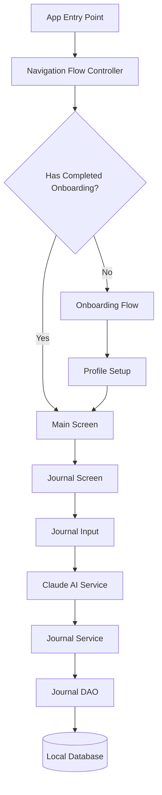

# Personal Hotfix v1.0.1 Design Document

## Overview

This design document outlines the technical approach for addressing three critical issues in the Spiral Journal app:
1. Onboarding loop issue
2. Keyboard dismissal issue
3. Claude AI commentary update issue

The design focuses on minimal, targeted changes to fix these specific issues without introducing new features or significant architectural changes.

## Architecture

The fixes will maintain the existing app architecture while addressing specific implementation issues:



### System Components

1. **Navigation Flow System**
   - `NavigationFlowController` - Controls app navigation flow
   - `SettingsService` - Will be enhanced to store onboarding completion state
   - `ProfileService` - Manages user profile data

2. **Input System**
   - `JournalScreen` - Main journaling interface
   - `JournalInput` - Text input widget for journal entries
   - `GestureDetector` - Will be added to handle tap-to-dismiss keyboard

3. **AI Analysis System**
   - `ClaudeAIService` - Handles API communication with Claude
   - `JournalService` - Manages journal entries and analysis
   - `JournalProvider` - Provides journal data to UI components

## Components and Interfaces

### 1. Onboarding Persistence Component

```dart
// Enhanced SettingsService
class SettingsService extends ChangeNotifier {
  // Existing methods...
  
  Future<bool> hasCompletedOnboarding() async {
    final prefs = await SharedPreferences.getInstance();
    return prefs.getBool('onboarding_completed') ?? false;
  }

  Future<void> setOnboardingCompleted() async {
    final prefs = await SharedPreferences.getInstance();
    await prefs.setBool('onboarding_completed', true);
  }
}
```

```dart
// Enhanced NavigationFlowController
class NavigationFlowController {
  final ProfileService _profileService;
  final SettingsService _settingsService;
  
  NavigationFlowController({
    required ProfileService profileService,
    required SettingsService settingsService,
  }) : _profileService = profileService,
       _settingsService = settingsService;
  
  Future<Widget> determineStartScreen() async {
    final hasProfile = await _profileService.hasProfile();
    final hasCompletedOnboarding = await _settingsService.hasCompletedOnboarding();
    
    if (!hasProfile || !hasCompletedOnboarding) {
      return OnboardingScreen();
    } else {
      return MainScreen();
    }
  }
}
```

### 2. Keyboard Dismissal Component

```dart
// Enhanced JournalScreen
@override
Widget build(BuildContext context) {
  return GestureDetector(
    onTap: () => FocusScope.of(context).unfocus(), // Dismiss keyboard on tap
    child: Scaffold(
      // Existing scaffold content
    ),
  );
}
```

```dart
// Enhanced JournalInput
Widget build(BuildContext context) {
  return GestureDetector(
    onTap: () => FocusScope.of(context).unfocus(),
    child: Column(
      children: [
        // Existing content
        TextField(
          // Existing properties
          textInputAction: TextInputAction.done, // Add done button
          onSubmitted: (_) => FocusScope.of(context).unfocus(), // Dismiss on done
        ),
      ],
    ),
  );
}
```

### 3. AI Commentary Update Component

```dart
// Enhanced ClaudeAIService
Future<String?> analyzeJournalEntry(JournalEntry entry) async {
  try {
    // Add retry mechanism
    int retryCount = 0;
    const maxRetries = 3;
    
    while (retryCount < maxRetries) {
      try {
        final response = await _provider.sendMessage(
          "Analyze this journal entry and provide a short, empathetic response: ${entry.content}",
        );
        
        if (response != null && response.isNotEmpty) {
          return response;
        }
        
        retryCount++;
        await Future.delayed(Duration(seconds: 2 * retryCount)); // Exponential backoff
      } catch (e) {
        print('Error analyzing journal entry (attempt ${retryCount + 1}): $e');
        retryCount++;
        await Future.delayed(Duration(seconds: 2 * retryCount));
      }
    }
    
    return null;
  } catch (e) {
    print('Error in analyzeJournalEntry: $e');
    return null;
  }
}
```

```dart
// Enhanced JournalService
Future<void> analyzeEntry(JournalEntry entry) async {
  // Skip if entry already has commentary
  if (entry.aiCommentary != null && entry.aiCommentary!.isNotEmpty) {
    return;
  }
  
  final commentary = await _aiService.analyzeJournalEntry(entry);
  
  if (commentary != null && commentary.isNotEmpty) {
    final updatedEntry = entry.copyWith(aiCommentary: commentary);
    await _journalDao.updateJournalEntry(updatedEntry);
    
    // Notify listeners that entry has been updated
    notifyListeners();
  } else {
    // Schedule a retry for failed analyses
    Future.delayed(Duration(minutes: 1), () {
      analyzeEntry(entry);
    });
  }
}
```

```dart
// Enhanced JournalProvider
Future<void> addEntry(String content, Mood mood) async {
  final entry = JournalEntry(
    id: const Uuid().v4(),
    content: content,
    mood: mood,
    timestamp: DateTime.now(),
  );
  
  await _journalService.addEntry(entry);
  
  // Load entries immediately to show the new entry
  await loadEntries();
  
  // Then analyze in background and refresh when done
  _journalService.analyzeEntry(entry).then((_) {
    loadEntries(); // Refresh entries after analysis completes
  });
}

Future<void> loadEntries() async {
  _entries = await _journalService.getEntries();
  notifyListeners();
  
  // Check for entries without AI commentary and analyze them
  _reanalyzeEntriesIfNeeded();
}

Future<void> _reanalyzeEntriesIfNeeded() async {
  if (_entries.isEmpty) return;
  
  for (final entry in _entries) {
    if (entry.aiCommentary == null || entry.aiCommentary!.isEmpty) {
      await _journalService.analyzeEntry(entry);
    }
  }
}
```

## Data Models

No changes to data models are required for this hotfix. The existing models already support the required functionality:

- `JournalEntry` - Already has an `aiCommentary` field
- `UserProfile` - No changes needed
- `Mood` - No changes needed

## Error Handling

### Onboarding Persistence
- If `SharedPreferences` fails, the app will default to showing onboarding
- Error logging will be added to track persistence failures

### Keyboard Dismissal
- Multiple dismissal methods ensure redundancy if one method fails
- Focus management will be properly handled to prevent keyboard issues

### AI Commentary
- Retry mechanism with exponential backoff for API failures
- Background processing to prevent UI blocking
- Automatic reanalysis of entries without commentary

## Testing Strategy

### Unit Tests
- Test `SettingsService` onboarding persistence methods
- Test `NavigationFlowController` routing logic
- Test `ClaudeAIService` retry mechanism
- Test `JournalService` analysis and update methods

### Widget Tests
- Test keyboard dismissal in `JournalScreen` and `JournalInput`
- Test UI updates when AI commentary is added

### Integration Tests
- Test complete onboarding flow and app restart
- Test journal entry creation and AI analysis flow
- Test keyboard behavior across multiple screens

### Manual Testing
- Fresh install test
- App restart after onboarding test
- Keyboard dismissal in various scenarios
- AI commentary appearance in journal history

## Implementation Considerations

### Backward Compatibility
- Changes will be backward compatible with existing user data
- No database schema changes required

### Performance Impact
- Minimal performance impact expected
- Background processing for AI analysis to prevent UI blocking

### Security Considerations
- No new security concerns introduced
- Existing data protection mechanisms remain in place

## Alternatives Considered

### Onboarding Loop
- Considered using a more complex state management solution, but `SharedPreferences` is sufficient and simpler
- Considered adding migration logic for existing users, but the current approach handles this case

### Keyboard Dismissal
- Considered custom keyboard handling, but standard Flutter patterns are more reliable
- Considered platform-specific keyboard handling, but a unified approach is simpler

### AI Commentary
- Considered implementing a local queue for failed analyses, but the retry mechanism is simpler
- Considered showing a loading indicator during analysis, but background processing provides better UX