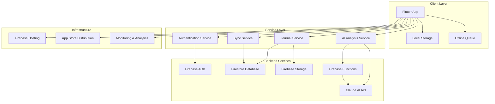
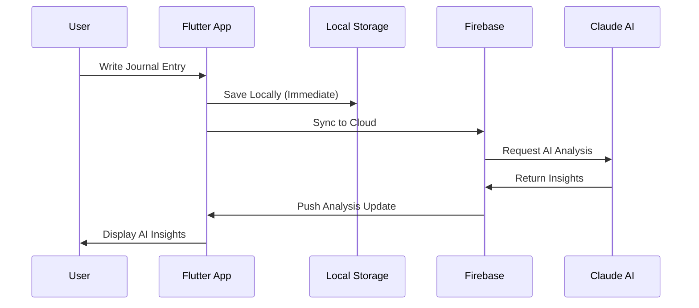
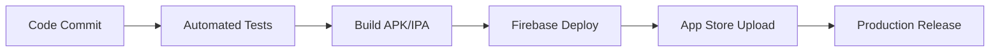

# Design Document

## Overview

The production deployment of Spiral Journal transforms the current Material Design 3 prototype into a fully functional AI-powered journaling platform. The architecture follows a clean, layered approach with Firebase as the backend service, Claude AI for emotional intelligence analysis, and a robust Flutter frontend that maintains the existing beautiful UI while adding production-grade functionality.

The system is designed for scalability, security, and offline-first operation, ensuring users can journal anytime while their data remains synchronized and secure across all devices.

## Architecture

### High-Level Architecture



### Data Flow Architecture



## Components and Interfaces

### 1. Authentication System

**Purpose**: Secure user registration, login, and session management

**Components**:
- `AuthService`: Handles Firebase Authentication integration
- `AuthRepository`: Manages authentication state and user data
- `AuthScreens`: Login, signup, and password reset UI

**Key Interfaces**:
```dart
abstract class AuthService {
  Future<User?> signInWithEmail(String email, String password);
  Future<User?> signUpWithEmail(String email, String password);
  Future<void> signOut();
  Future<void> resetPassword(String email);
  Stream<User?> get authStateChanges;
}
```

### 2. Data Persistence Layer

**Purpose**: Offline-first data storage with cloud synchronization

**Components**:
- `LocalStorageService`: SQLite database for offline storage
- `CloudStorageService`: Firestore integration for cloud sync
- `SyncService`: Manages data synchronization between local and cloud
- `DataRepository`: Unified interface for data operations

**Key Interfaces**:
```dart
abstract class JournalRepository {
  Future<List<JournalEntry>> getEntries({DateTime? startDate, DateTime? endDate});
  Future<JournalEntry> saveEntry(JournalEntry entry);
  Future<void> deleteEntry(String entryId);
  Future<List<JournalEntry>> searchEntries(String query);
  Stream<List<JournalEntry>> watchEntries();
}
```

### 3. AI Analysis Engine

**Purpose**: Claude AI integration for emotional intelligence analysis

**Components**:
- `AIAnalysisService`: Claude API integration
- `EmotionalAnalyzer`: Processes journal content for emotional insights
- `CoreEvolutionEngine`: Updates personality cores based on analysis
- `PatternRecognitionService`: Identifies emotional patterns over time

**Key Interfaces**:
```dart
abstract class AIAnalysisService {
  Future<EmotionalAnalysis> analyzeEntry(String content);
  Future<List<EmotionalCore>> updateCores(List<JournalEntry> recentEntries);
  Future<List<EmotionalPattern>> identifyPatterns(List<JournalEntry> entries);
}

class EmotionalAnalysis {
  final List<String> primaryEmotions;
  final double emotionalIntensity;
  final List<String> copingMechanisms;
  final List<String> emotionalStrengths;
  final String insight;
}
```

### 4. Notification System

**Purpose**: Gentle reminders and progress tracking

**Components**:
- `NotificationService`: Local notification scheduling
- `ReminderManager`: Manages journaling reminders
- `ProgressTracker`: Tracks streaks and milestones

**Key Interfaces**:
```dart
abstract class NotificationService {
  Future<void> scheduleReminder(DateTime scheduledTime, String message);
  Future<void> cancelAllReminders();
  Future<void> showProgressNotification(int streakDays);
}
```

### 5. State Management

**Purpose**: Reactive state management across the app

**Components**:
- `AppState`: Global application state using Provider/Riverpod
- `JournalState`: Journal-specific state management
- `AuthState`: Authentication state management
- `SyncState`: Synchronization status management

## Data Models

### Enhanced Journal Entry Model

```dart
class JournalEntry {
  final String id;
  final String userId;
  final DateTime createdAt;
  final DateTime updatedAt;
  final String content;
  final List<String> manualMoods;
  final EmotionalAnalysis? aiAnalysis;
  final bool isSynced;
  final Map<String, dynamic> metadata;
  
  // Existing fields maintained for compatibility
  final List<String> moods;
  final String dayOfWeek;
}
```

### User Profile Model

```dart
class UserProfile {
  final String userId;
  final String email;
  final String displayName;
  final DateTime createdAt;
  final UserPreferences preferences;
  final List<EmotionalCore> personalityCores;
  final JournalingStats stats;
}

class UserPreferences {
  final bool enableReminders;
  final List<TimeOfDay> reminderTimes;
  final bool enableAIAnalysis;
  final String preferredLanguage;
  final bool enableOfflineMode;
}
```

### AI Analysis Models

```dart
class EmotionalAnalysis {
  final String entryId;
  final DateTime analyzedAt;
  final List<EmotionScore> emotions;
  final double overallSentiment;
  final List<String> keyThemes;
  final String personalizedInsight;
  final List<String> suggestedReflections;
}

class EmotionScore {
  final String emotion;
  final double intensity; // 0.0 to 1.0
  final double confidence; // 0.0 to 1.0
}
```

## Error Handling

### Error Categories

1. **Network Errors**: Connection failures, API timeouts
2. **Authentication Errors**: Invalid credentials, expired sessions
3. **Data Errors**: Sync conflicts, storage failures
4. **AI Service Errors**: Analysis failures, rate limiting
5. **User Input Errors**: Validation failures, malformed data

### Error Handling Strategy

```dart
class AppError {
  final ErrorType type;
  final String message;
  final String? userMessage;
  final dynamic originalError;
  final StackTrace? stackTrace;
  
  bool get isRecoverable => type.isRecoverable;
  bool get shouldRetry => type.shouldRetry;
}

enum ErrorType {
  network(isRecoverable: true, shouldRetry: true),
  authentication(isRecoverable: true, shouldRetry: false),
  validation(isRecoverable: true, shouldRetry: false),
  aiService(isRecoverable: true, shouldRetry: true),
  storage(isRecoverable: false, shouldRetry: false);
  
  const ErrorType({required this.isRecoverable, required this.shouldRetry});
  final bool isRecoverable;
  final bool shouldRetry;
}
```

### Graceful Degradation

- **AI Analysis Unavailable**: Fall back to manual mood selection
- **Network Offline**: Full offline functionality with sync queue
- **Authentication Issues**: Guest mode with local storage only
- **Storage Full**: Automatic cleanup of old cached data

## Testing Strategy

### Unit Testing

**Coverage Target**: 90%+ for business logic

**Key Areas**:
- Data models and serialization
- Service layer methods
- AI analysis processing
- Sync logic and conflict resolution
- Authentication flows

**Testing Framework**: 
```dart
// Example test structure
group('JournalService', () {
  late JournalService service;
  late MockRepository mockRepo;
  
  setUp(() {
    mockRepo = MockRepository();
    service = JournalService(mockRepo);
  });
  
  test('should save entry locally when offline', () async {
    // Test implementation
  });
});
```

### Integration Testing

**Scenarios**:
- End-to-end user journaling flow
- Authentication and data sync
- Offline-to-online synchronization
- AI analysis integration
- Cross-device data consistency

### Widget Testing

**Components**:
- Journal input widget with auto-save
- Mood selector with AI integration
- History screen with search/filter
- Settings screen with preferences
- Authentication screens

### Performance Testing

**Metrics**:
- App startup time < 3 seconds
- Journal entry save time < 500ms
- Search response time < 1 second
- AI analysis completion < 10 seconds
- Memory usage optimization

## Security Considerations

### Data Encryption

- **At Rest**: Firestore automatic encryption + client-side encryption for sensitive fields
- **In Transit**: HTTPS/TLS for all API communications
- **Local Storage**: SQLCipher for encrypted local database

### Authentication Security

- **Firebase Auth**: Industry-standard OAuth 2.0 implementation
- **Session Management**: Automatic token refresh and secure storage
- **Password Requirements**: Strong password enforcement
- **Account Recovery**: Secure email-based password reset

### AI Privacy

- **Data Minimization**: Only send necessary content to Claude AI
- **No Persistent Storage**: AI service doesn't retain user data
- **Anonymization**: Remove personally identifiable information before analysis
- **User Consent**: Explicit opt-in for AI analysis features

### API Security

- **Rate Limiting**: Prevent abuse of AI and Firebase services
- **Input Validation**: Sanitize all user inputs
- **Error Handling**: Don't expose sensitive information in error messages
- **Audit Logging**: Track security-relevant events

## Deployment Architecture

### Firebase Project Structure

```
spiral-journal-prod/
├── Authentication (Firebase Auth)
├── Firestore Database
│   ├── users/{userId}
│   ├── journal_entries/{entryId}
│   ├── ai_analyses/{analysisId}
│   └── user_cores/{userId}
├── Cloud Storage (for future file attachments)
├── Cloud Functions (AI processing)
└── Hosting (for web version)
```

### Environment Configuration

**Development Environment**:
- Firebase project: `spiral-journal-dev`
- Claude AI: Development API keys
- Debug logging enabled

**Production Environment**:
- Firebase project: `spiral-journal-prod`
- Claude AI: Production API keys
- Error reporting and analytics
- Performance monitoring

### CI/CD Pipeline



## Performance Optimization

### App Performance

- **Lazy Loading**: Load journal entries on demand
- **Image Optimization**: Compress and cache mood/core icons
- **Memory Management**: Proper disposal of streams and controllers
- **Background Processing**: AI analysis in background threads

### Database Performance

- **Indexing**: Optimize Firestore queries with proper indexes
- **Pagination**: Load journal entries in batches
- **Caching**: Intelligent local caching with TTL
- **Query Optimization**: Minimize database reads

### Network Optimization

- **Request Batching**: Combine multiple operations
- **Compression**: Enable gzip for API responses
- **Retry Logic**: Exponential backoff for failed requests
- **Connection Pooling**: Reuse HTTP connections

## Monitoring and Analytics

### Application Monitoring

- **Firebase Crashlytics**: Crash reporting and analysis
- **Firebase Performance**: App performance metrics
- **Custom Metrics**: Journaling frequency, AI analysis success rates
- **User Engagement**: Feature usage analytics

### Business Metrics

- **Daily Active Users**: Track user engagement
- **Journal Entry Frequency**: Monitor user habits
- **AI Analysis Usage**: Track feature adoption
- **Retention Rates**: Measure long-term engagement

### Alerting

- **Error Rate Thresholds**: Alert on high error rates
- **Performance Degradation**: Monitor response times
- **Service Availability**: Track uptime and outages
- **User Feedback**: Monitor app store reviews and ratings