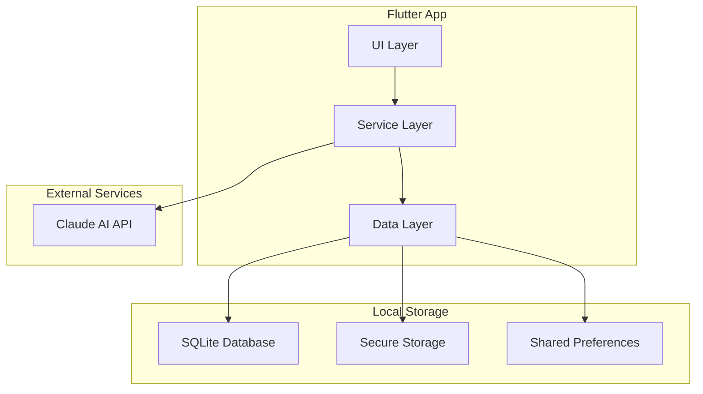
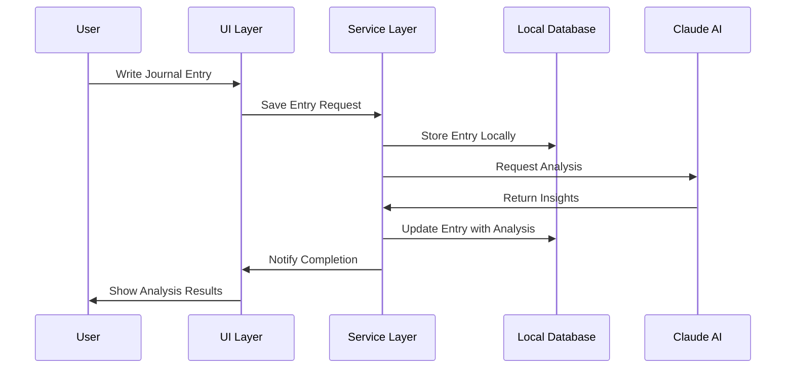

# Design Document

## Overview

The TestFlight-ready version of Spiral Journal focuses on creating a fully functional local journaling app with AI analysis capabilities. This simplified architecture eliminates cloud dependencies while maintaining the core user experience. The app will feature PIN-based security, local encrypted storage, Claude AI integration for emotional analysis, and a complete dark/light theme system.

The design prioritizes rapid deployment to TestFlight while ensuring a polished user experience that showcases the app's core value proposition.

## Architecture

### High-Level Architecture



### Data Flow Architecture



## Components and Interfaces

### 1. Authentication System (PIN-based)

**Purpose**: Simple, secure local authentication

**Components**:
- `PinAuthService`: Manages PIN creation, validation, and storage
- `BiometricService`: Optional biometric authentication support
- `AuthGuard`: Protects app navigation

**Key Interfaces**:
```dart
abstract class PinAuthService {
  Future<bool> hasPinSet();
  Future<void> setPin(String pin);
  Future<bool> validatePin(String pin);
  Future<void> resetPin(); // Clears all data
  Future<bool> isBiometricAvailable();
  Future<bool> authenticateWithBiometric();
}
```

### 2. Local Data Persistence

**Purpose**: Encrypted local storage for journal entries and user data

**Components**:
- `LocalDatabaseService`: SQLite operations with encryption
- `SecureStorageService`: Sensitive data storage (PIN, API keys)
- `JournalRepository`: Unified data access interface

**Key Interfaces**:
```dart
abstract class JournalRepository {
  Future<List<JournalEntry>> getAllEntries();
  Future<JournalEntry> saveEntry(JournalEntry entry);
  Future<void> deleteEntry(String entryId);
  Future<List<JournalEntry>> searchEntries(String query);
  Future<List<JournalEntry>> getEntriesByDateRange(DateTime start, DateTime end);
  Future<List<JournalEntry>> getEntriesByMood(String mood);
}
```

### 3. AI Analysis Engine

**Purpose**: Claude AI integration for emotional intelligence analysis

**Components**:
- `ClaudeAIService`: Direct API integration
- `EmotionalAnalyzer`: Processes AI responses
- `CoreEvolutionEngine`: Updates personality cores
- `AnalysisCache`: Local caching to reduce API calls

**Key Interfaces**:
```dart
abstract class AIAnalysisService {
  Future<EmotionalAnalysis> analyzeEntry(String content);
  Future<List<EmotionalCore>> updateCores(List<JournalEntry> entries);
  Future<EmotionalInsight> generateInsight(List<JournalEntry> recentEntries);
}

class EmotionalAnalysis {
  final List<String> primaryEmotions;
  final double emotionalIntensity;
  final List<String> keyThemes;
  final String personalizedInsight;
  final Map<String, double> coreImpacts; // Impact on each personality core
}
```

### 4. Theme System

**Purpose**: Complete light/dark mode implementation

**Components**:
- `ThemeService`: Manages theme state and persistence
- `AppTheme`: Extended theme definitions
- `ThemeProvider`: State management for theme changes

**Key Interfaces**:
```dart
abstract class ThemeService {
  Future<ThemeMode> getThemeMode();
  Future<void> setThemeMode(ThemeMode mode);
  bool get isSystemTheme;
  ThemeData get lightTheme;
  ThemeData get darkTheme;
}
```

### 5. Core Library System

**Purpose**: Complete personality core tracking and evolution

**Components**:
- `CoreLibraryService`: Manages core data and calculations
- `CoreProgressCalculator`: Determines core evolution
- `CoreInsightGenerator`: Creates personalized core insights

**Key Interfaces**:
```dart
abstract class CoreLibraryService {
  Future<List<EmotionalCore>> getAllCores();
  Future<EmotionalCore> getCoreById(String coreId);
  Future<void> updateCoreProgress(String coreId, double progress);
  Future<List<CoreMilestone>> getCoreMilestones(String coreId);
  Future<CoreInsight> generateCoreInsight(String coreId);
}
```

### 6. Settings and Preferences System

**Purpose**: User preferences and app configuration management

**Components**:
- `SettingsService`: Manages all user preferences and app settings
- `UserPreferences`: Data model for user configuration
- `SettingsRepository`: Persistent storage for user preferences

**Key Interfaces**:
```dart
abstract class SettingsService {
  Future<UserPreferences> getPreferences();
  Future<void> updatePreferences(UserPreferences preferences);
  Future<bool> getPersonalizedInsightsEnabled();
  Future<void> setPersonalizedInsightsEnabled(bool enabled);
  Future<ThemeMode> getThemeMode();
  Future<void> setThemeMode(ThemeMode mode);
  Future<bool> getBiometricAuthEnabled();
  Future<void> setBiometricAuthEnabled(bool enabled);
}

class UserPreferences {
  final bool personalizedInsightsEnabled;
  final ThemeMode themeMode;
  final bool biometricAuthEnabled;
  final bool analyticsEnabled;
  
  UserPreferences({
    this.personalizedInsightsEnabled = true,
    this.themeMode = ThemeMode.system,
    this.biometricAuthEnabled = false,
    this.analyticsEnabled = true,
  });
}
```

## Data Models

### Enhanced Journal Entry Model

```dart
class JournalEntry {
  final String id;
  final DateTime createdAt;
  final DateTime updatedAt;
  final String content;
  final List<String> manualMoods;
  final EmotionalAnalysis? aiAnalysis;
  final bool isAnalyzed;
  final String? draftContent; // For crash recovery
  
  // Existing compatibility fields
  final List<String> moods;
  final String dayOfWeek;
}
```

### Emotional Core Model

```dart
class EmotionalCore {
  final String id;
  final String name;
  final String description;
  final double currentLevel; // 0.0 to 1.0
  final double previousLevel;
  final DateTime lastUpdated;
  final List<CoreMilestone> milestones;
  final List<CoreInsight> recentInsights;
  final Color primaryColor;
  final Color secondaryColor;
}

class CoreMilestone {
  final String id;
  final String title;
  final String description;
  final double threshold;
  final bool isAchieved;
  final DateTime? achievedAt;
}
```

### Theme Models

```dart
class AppThemeData {
  final ThemeData lightTheme;
  final ThemeData darkTheme;
  final ColorScheme lightColorScheme;
  final ColorScheme darkColorScheme;
}

enum ThemeMode { system, light, dark }
```

## Error Handling

### Error Categories

1. **Storage Errors**: Database failures, encryption issues
2. **AI Service Errors**: API failures, network issues
3. **Authentication Errors**: PIN validation, biometric failures
4. **Theme Errors**: Theme loading, preference issues

### Error Handling Strategy

```dart
class AppError {
  final ErrorType type;
  final String message;
  final String userMessage;
  final bool isRecoverable;
  
  static AppError storage(String message) => AppError(
    type: ErrorType.storage,
    message: message,
    userMessage: "Unable to save your entry. Please try again.",
    isRecoverable: true,
  );
}

enum ErrorType {
  storage,
  network,
  authentication,
  aiService,
  theme,
}
```

### Graceful Degradation

- **AI Analysis Unavailable**: Fall back to manual mood selection
- **Storage Issues**: Show error and retry options
- **Theme Loading Fails**: Default to system theme
- **PIN Authentication Fails**: Provide reset option

## Security Considerations

### Local Data Security

- **PIN Storage**: Hashed and salted using device keychain
- **Database Encryption**: SQLCipher for encrypted local database
- **Biometric Integration**: iOS Keychain with biometric protection
- **Data Export**: Encrypted JSON with user-controlled decryption

### API Security

- **Claude AI**: Secure API key storage in device keychain
- **Request Sanitization**: Remove PII before sending to AI
- **Response Validation**: Validate AI responses before storage
- **Rate Limiting**: Local rate limiting to prevent API abuse

## UI/UX Design

### Theme Implementation

**Light Theme (Existing)**:
- Primary: Warm oranges (#865219, #FDB876)
- Background: Cream tones (#FFF8F5, #FAEBE0)
- Text: Dark browns and blacks

**Dark Theme (New)**:
- Primary: Muted oranges (#B8763A, #8B5A2B)
- Background: Dark grays (#121212, #1E1E1E)
- Surface: Elevated dark surfaces (#2C2C2C, #383838)
- Text: Light grays and whites

### Core Library UI

**Core Display**:
- Circular progress indicators for each core
- Color-coded core categories
- Animated progress changes
- Milestone celebration animations

**Core Detail View**:
- Progress timeline
- Recent insights and developments
- Milestone achievements
- Personalized recommendations

## Performance Optimization

### Database Performance

- **Indexing**: Proper indexes on date, mood, and content fields
- **Pagination**: Load entries in batches of 20-50
- **Caching**: In-memory cache for recent entries
- **Background Operations**: Database operations on background threads

### AI Analysis Performance

- **Caching**: Cache analysis results locally
- **Batching**: Analyze multiple entries together when possible
- **Background Processing**: AI calls on background threads
- **Fallback**: Quick manual mood selection if AI is slow

### UI Performance

- **Lazy Loading**: Load journal entries on demand
- **Image Optimization**: Compress and cache core icons
- **Animation Performance**: Use efficient animations
- **Memory Management**: Proper disposal of controllers and streams

## Testing Strategy

### Unit Testing

**Core Areas**:
- PIN authentication logic
- Data persistence operations
- AI analysis processing
- Theme switching logic
- Core evolution calculations

### Widget Testing

**Key Components**:
- PIN entry screens
- Journal input with auto-save
- Theme switching
- Core library display
- Search and filter functionality

### Integration Testing

**User Flows**:
- Complete journaling workflow
- PIN setup and authentication
- Theme switching across app
- Core progress tracking
- Data export functionality

## Deployment Configuration

### iOS Build Configuration

**Info.plist Updates**:
```xml
<key>NSFaceIDUsageDescription</key>
<string>Use Face ID to quickly access your journal</string>
<key>ITSAppUsesNonExemptEncryption</key>
<false/>
```

**Build Settings**:
- Deployment target: iOS 12.0+
- Swift version: 5.0+
- Bitcode: Enabled
- App Transport Security: Enabled

### Environment Configuration

**Development**:
- Claude AI: Development API keys
- Debug logging: Enabled
- Crash reporting: Disabled

**TestFlight**:
- Claude AI: Production API keys
- Debug logging: Minimal
- Crash reporting: Enabled
- Analytics: Basic usage tracking

### App Store Metadata

**Privacy Labels**:
- Data Not Collected (since everything is local)
- Optional: AI analysis with no data retention

**App Description Focus**:
- Local-first journaling
- AI-powered insights
- Privacy-focused design
- Beautiful Material Design 3 UI

## Monitoring and Analytics

### Local Analytics

**Key Metrics**:
- Journal entry frequency
- AI analysis usage
- Core progress tracking
- Theme preference usage
- Feature adoption rates

**Error Tracking**:
- Crash logs (local storage)
- Error frequency by type
- Performance metrics
- User flow completion rates

### TestFlight Feedback

**Feedback Collection**:
- In-app feedback form
- TestFlight notes integration
- Usage pattern analysis
- Performance monitoring

**Success Metrics**:
- Daily active usage
- Entry completion rates
- AI analysis engagement
- Core library interaction
- Theme switching frequency